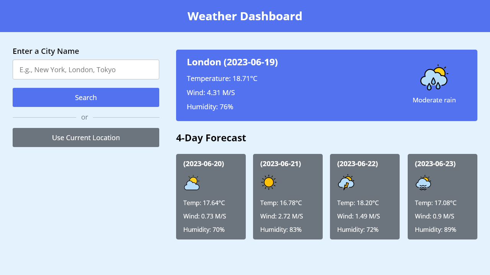

# G-Weather-Forecast

This is the instruction for Flutter developer intern assignment at [Golden Owl](https://goldenowl.asia). You will build a simple web application.

Template example

# Requirements
**You must follow the `Template example UI` above. Otherwise, you will be disqualified.**

Use service from api provider https://www.weatherapi.com  (free version)  

Create a new account and get a new api key.

API doc or swagger Tool:
  - [Api document](https://www.weatherapi.com/docs)
  - [Swagger Tool](https://app.swaggerhub.com/apis-docs/WeatherAPI.com/WeatherAPI/1.0.2)

You need to build a web application with Flutter and your demo should have at least features in [Must have](#must-have), things in [Nice to have](#nice-to-have) is optional (but yeah, it's attractive if you have).

### Must have:

- Search for a city or country and display weather information:
  - Show the weather includes temperature, wind speed, humidity... for present day.
  - Show forecast 4 days later and more (load more).
- Save temporary weather information history and allow display again during the day.
- There is a function to register and unsubscribe to receive daily weather forecast information via email address. Email confirmation is ***`required`***.
- Deploy the Flutter Web App to go live. (Recommend to use Firebase Hosting)

### Nice to have:

- Responsive design (look good on all devices: desktops, tablets & mobile phones).
- Smooth animations (just do what you think is good).

# Technical Requirements
- Language: Flutter / Kotlin / Swift or React Native
- Fonts (optional):
  - [https://fonts.google.com/specimen/Rubik?query=Rubik](https://fonts.google.com/specimen/Rubik?query=Rubik)
- Store data
- OOP programming for object-oriented languages
- Form validation
- State management

### Deployment
Some providers allow free deployment for the trial version  (note: Maybe some suppliers will update their policies and prices)
- Build APK
- Firebase Hosting - https://firebase.google.com/docs/hosting
- Heroku - https://heroku.com 
- Vercel (Zeit) - https://vercel.com
- Fly - https://fly.io
- `...`
| Nice to have a video demo record

# Submission

After completing the assignment, please push the source code to remote repository (github/gitlab), then send us the link to your repository.

Don't forget to add `README.md` which includes guide to run your project locally and demo link.

**GOOD LUCK!!!**
